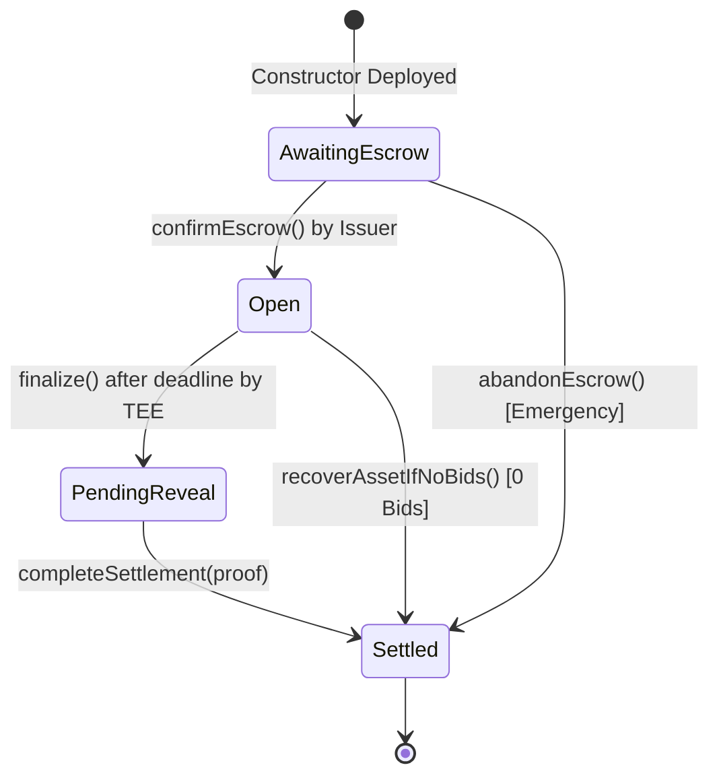

# PRD v2.0 — Nirliptha: Confidential Primary Market Auction Protocol

> **Dokumen Spesifikasi Produk & Arsitektur Sistem (Production-Ready v2.0)**  
> **Status:** Live & Deployed di Ethereum Sepolia Testnet  
> **Repository Root:** `Nirliptha`  
> **Terakhir Diperbarui:** 28 Juli 2026  

---

## 1. Executive Summary & Visi Produk

### 1.1. Problem Statement (Masalah Pasar)
Penerbitan perdana aset riil (*Real-World Assets / RWA*) seperti obligasi korporasi, pendanaan infrastruktur, dan tender komersial selama ini menghadapi dilema privasi mendasar:
1. **Model Tradisional (Off-Chain)**: Mengandalkan perantara/operator lelang terpusat yang memegang data penawaran rahasia (*sealed-bid*). Model ini rawan pembocoran data, penyogokan, dan *front-running* internal (seperti kasus Vitol-Petroecuador & Boeing-Lockheed).
2. **Model Blockchain Publik Biasa (On-Chain)**: Seluruh angka penawaran (harga & kuantitas) dan kepemilikan aset terekspos secara transparan dan permanen di ledger publik. Hal ini menghalangi masuknya investor institusional (seperti a16z, 2026) karena risiko *MEV exploitation* dan *market signaling leakage*.

### 1.2. Solusi Protokol Nirliptha
**Nirliptha** (*berasal dari bahasa Sanskerta: "Terlepas / Tak Tersentuh oleh Kontaminasi"*) adalah protokol lelang perdana (*primary market auction*) berbasis **Confidential Sealed-Bid Uniform-Price** yang dibangun di atas **Nox Protocol TEE Enclave** dan **Ethereum Sepolia Testnet**.

**Inovasi Utama Nirliptha:**
- **Encrypted Bidding On-Chain**: Nilai kuantitas ($Q$) dan harga ($P$) dienkripsi langsung di perangkat pengguna menggunakan SDK Nox (`euint256`). Tidak ada manusia (termasuk Issuer, operator lelang, maupun validator blockchain) yang dapat mengintip nilai penawaran.
- **Confidential Settlement & ERC-7984**: Pembayaran deposit menggunakan stablecoin rahasia (`cUSD`) dan pembagian hasil kemenangan berupa token aset rahasia (`cAsset`). Saldo dan histori transaksi bersifat privat secara *on-chain*.
- **TEE Enclave Uniform-Price Resolution**: Penentuan harga penutupan tunggal (*clearing price*) dan alokasi pemenang dihitung di dalam ruang komputasi aman (*Trusted Execution Environment / TEE*).
- **Selective Auditability & Handle Rotation**: Akses audit dapat diberikan secara *selective disclosure* kepada pihak berwenang (`grantAuditView`), dan dapat dibutakan kembali secara kriptografis melalui rotasi handle TEE (`rotateHandles`).
- **Gnosis Safe Treasury Integration**: Seluruh dana hasil penjualan aset (*settlement proceeds*) disetorkan secara otomatis ke alamat *Multi-Sig Treasury Safe* milik Issuer.

---

## 2. Kontrak Terdeploy & Matriks Arsitektur (Ethereum Sepolia)

Seluruh komponen smart contract protokol **Nirliptha** telah **100% dideploy, diverifikasi di Etherscan, dan diuji secara live tanpa data mock** pada Ethereum Sepolia Testnet (Chain ID: `11155111`):

| Kontrak / Entitas | Alamat Kontrak (Address) | Tipe Standard / Fungsi | Etherscan Link |
| :--- | :--- | :--- | :--- |
| **`cUSD`** | `0x7309886ee42Aa29a796A479A01Eef07a61c8F6Fd` | ERC-7984 Confidential Stablecoin | [Lihat di Etherscan](https://sepolia.etherscan.io/address/0x7309886ee42Aa29a796A479A01Eef07a61c8F6Fd) |
| **`cAsset`** | `0x43d81618774059F0172b7B32c972271a6440003D` | ERC-7984 Confidential RWA Bond | [Lihat di Etherscan](https://sepolia.etherscan.io/address/0x43d81618774059F0172b7B32c972271a6440003D) |
| **`AuctionFactory`**| `0x39536Ea5789538D7F76999e8BDE5679526F815Df` | Factory Pattern Registry | [Lihat di Etherscan](https://sepolia.etherscan.io/address/0x39536Ea5789538D7F76999e8BDE5679526F815Df) |
| **`Gnosis Safe`** | `0x6Ca474410D2d9532e9355Ca754fe62a3E340dA63` | Multi-sig Treasury Issuer | [Lihat di Etherscan](https://sepolia.etherscan.io/address/0x6Ca474410D2d9532e9355Ca754fe62a3E340dA63) |
| **`Demo Auction`** | `0x3c35ea01f9c197d01Ad6345CA41EB4bFdac84a86` | Live Verified Auction Instance | [Lihat di Etherscan](https://sepolia.etherscan.io/address/0x3c35ea01f9c197d01Ad6345CA41EB4bFdac84a86) |

---

## 3. Fitur Utama & Lifecycle State Machine

### 3.1. State Machine Lelang (`AuctionTypes.Status`)
Mesin lelang pada `Auction.sol` dikontrol oleh state machine 4 tahap yang dieksekusi secara ketat:



1. **`AwaitingEscrow (0)`**: Kontrak lelang baru ter-deploy via Factory. Lelang menunggu Issuer mentransfer pasokan token `cAsset` ke kontrak dan memanggil `confirmEscrow()`.
2. **`Open (1)`**: Escrow terkonfirmasi. Sesi *bidding* dibuka untuk publik. Investor dapat mengirimkan penawaran terenkripsi (`submitBid`).
3. **`PendingReveal (2)`**: Durasi lelang berakhir (*deadline passed*). Issuer memanggil `finalize()`. TEE Enclave menghitung alokasi dan menandai *clearing price handle* untuk dekripsi publik (`allowPublicDecryption`).
4. **`Settled (3)`**: Bukti dekripsi publik diserahkan (`completeSettlement`). Lelang selesai. Investor dapat memanggil `claim()`, dan Issuer dapat menarik dana lelang ke Gnosis Safe (`withdrawToSafe`).

---

## 4. Spesifikasi Fungsionalitas Pengguna

### 4.1. Portal Issuer (Penerbit Aset)
- **Wizard Pembuatan Lelang (`CreateAuctionForm.tsx`)**:
  - Konfigurasi parameter publik lelang: Judul Aset (*Asset Title*), Kuantitas Aset (`cASSET`), Harga Minimum / Reserve Price (`cUSD`), dan Durasi Lelang (Jam/Menit/Detik).
  - Pendaftaran otomatis alamat wallet terhubung sebagai Issuer & tujuan penyetoran dana *Settlement Treasury*.
- **Panel Kontrol Dashboard (`IssuerDashboard.tsx`)**:
  - **Konfirmasi Escrow**: Memindahkan status dari `AwaitingEscrow` ke `Open`.
  - **Finalize & TEE Resolution**: Memicu sorting TEE saat lelang usai. Dilengkapi proteksi waktu *client-side* untuk mencegah kegagalan transaksi on-chain (`0x4bf015d5`).
  - **Penyelesaian Clearing Price (`completeSettlement`)**: Mengonsumsi *decryption proof* dari Nox Gateway dan mempublikasikan *clearing price* final.
  - **Penarikan Dana Settlement (`withdrawToSafe`)**: Menyertakan dana pembayaran lelang langsung ke Gnosis Safe Multi-sig Treasury milik Issuer.
  - **Pintu Darurat Recovery**:
    - `recoverAssetIfNoBids()`: Mengembalikan token `cAsset` ke Safe jika lelang berakhir tanpa penawaran (0 Bids).
    - `abandonEscrow()`: Batalkan pembukaan lelang jika wizard terhenti sebelum `confirmEscrow()`.
- **Panel Dompet Stripe-Style (`IssuerWalletPanel.tsx`)**:
  - Ringkasan **Network Balance** (Sepolia ETH untuk *gas fee*) dan **Settlement Balance** (Confidential `cUSD` hasil lelang).
- **Governance Audit & Rotasi (`GrantAuditModal.tsx`)**:
  - Mendaftarkan alamat auditor resmi untuk mengintip alokasi pemenang tertentu (`grantAuditView`).
  - Mengisolasi dan memutarkan handle TEE (`rotateHandles`) untuk membutakan auditor lama terhadap data lelang periode baru.

### 4.2. Portal Investor (Pemodal / Bidder)
- **Halaman Penawaran Aset (`InvestorListing.tsx`)**:
  - Menampilkan daftar lelang aktif dan historis di jaringan Sepolia.
- **Kartu Informasi Lelang Glassmorphic ([AuctionInfoCard.tsx](file:///C:/Belajar/Sem4/Hackathon/WTF/Nirliptha/frontend/src/components/AuctionInfoCard.tsx))**:
  - Tampilan visual *Glassmorphic Premium* (`backdrop-blur-2xl`) berisi metrik *Quantity For Sale*, *Minimum Price*, *Bids Submitted*, dan *Countdown Timer*.
  - Dilengkapi tombol navigasi tunggal di dalam card `← Back to Asset Offerings`.
- **Panel Pengiriman Penawaran Rahasia (`InvestorDashboard.tsx` & `useBid.ts`)**:
  - Enkripsi client-side $Q$ dan $P$ menggunakan SDK Nox (`encryptUint`).
  - Penguncian jaminan deposit ($Q \times P$) secara confidential via approval `cUSD.setOperator()`.
  - Pembatasan sistem **1 bid per wallet** dan **Maksimal 5 Bidders** per instance lelang.
- **Klaim Bersatu & Refund (`claim`)**:
  - Antarmuka klaim homogen (`claim()`) untuk pemenang dan peserta yang kalah.
  - Pemenang menerima alokasi `cAsset` + pengembalian kelebihan deposit $(P_{bid} - P_{clearing}) \times Q$.
  - Peserta yang kalah menerima pengembalian saldo `cUSD` deposit 100% secara otomatis.
- **Dompet Investor & Faucet (`InvestorWallet.tsx`)**:
  - Faucet Testnet mandiri untuk *minting* **`100.00 cUSD`** gratis.
  - Fitur Wrap/Unwrap saldo pembayaran.
  - Tampilan portofolio kepemilikan aset RWA terverifikasi (*Acquired RWA Holdings*).

---

## 5. Arsitektur Antarmuka (UI/UX) & Sistem Desain

Protokol Nirliptha mengusung standar estetika *High-End Web3 Design System*:

### 5.1. Branding & Tipografi
- **Nama Brand**: Strictly **`Nirliptha`**.
- **Logo Asset**: `public/icon.png` (Favicon, Apple Icon, Navbar Logo).
- **Hierarki Tipografi**:
  - Headings / Numbers: **`Copeland`** (`font-copeland`) & **`WordsTaken`** (`font-words-taken`).
  - Display Serifs: **`Instrument Serif`** (`font-serif`).
  - Body Text: **`Plus Jakarta Sans`** (`font-body`).
  - Monospace Data / Hash: **`JetBrains Mono`** (`font-mono`).

### 5.2. Komponen UI & Animasi Utama
1. **Landing Page Hero (`Hero.tsx`)**: Header glassmorphic dengan latar gelap bergradasi *oxblood red & obsidian black*.
2. **Sponsor Loop (`TechLoop.tsx`)**: Carousel logo korporat yang di-scale dengan rapi (`logoHeight={60}`).
3. **Animasi GSAP ScrollTrigger (`WhySection.tsx`)**: Sequensial reveal poin 01, 02, dan 03 berbasis timeline GSAP *unpinned* demi keamanan React Virtual DOM (mencegah crash `removeChild`).
4. **Alur 2-Kolom Layout (`HowItWorks.tsx`)**: Desain 2 kolom dengan judul sticky di kiri dan 4 kartu langkah tertumpuk di kanan (`font-copeland text-white` step numbers 01, 02, 03, 04).
5. **Footer Minimalis (`Footer.tsx`)**: Hak cipta bersih `© 2026 Nirliptha. All rights reserved.`.

---

## 6. Fitur Keamanan, Otomatisasi & Network Guard

### 6.1. Sepolia Network Enforcer (`SepoliaEnforcer.tsx`)
- **Auto Network Switch**: Memaksa wallet terhubung untuk langsung berpindah ke **Ethereum Sepolia Testnet** (Chain ID: `11155111`) saat pertama kali terhubung.
- **Global Top Banner**: Jika pengguna membatalkan prompt wallet atau berada di jaringan lain, banner peringatan mencolok akan terkunci di bagian atas layar dengan tombol `Switch to Sepolia Now ↗`.

### 6.2. Dynamic Offering Title Synchronization (`offeringTitles.ts`)
- **Real-Time Custom Event Sync**: Ketika Issuer mendaftarkan nama lelang custom (*"Qatar World Cup Stadium"*, *"LRT Jabodebek Fleet"*, *"Bali Solar Farm"*), nama disiarkan secara instant via event `offeringTitleUpdated` ke seluruh tab/komponen Investor.
- **Deterministic Address-Hash Fallback**: Jika tidak ada nama custom, sistem membuat fallback nama aset RWA unik berdasarkan hash alamat kontrak lelang di Sepolia.

### 6.3. Keamanan Smart Contract (Solidity Security & Anti-Shill)
- **ReentrancyGuard**: Semua fungsi mutating (`submitBid`, `finalize`, `claim`, `withdrawToSafe`, `recoverAssetIfNoBids`, `abandonEscrow`) dilindungi oleh `nonReentrant`.
- **Anti-Shill `paidFull` Gate**: Karena `ERC7984.confidentialTransferFrom` tidak mentrigger revert saat saldo kurang (melainkan memindahkan 0/sisa), `Auction.sol` mencatat `actualDeposit` dan membatalkan bid yang underfunded melalui gerbang `paidFull = (actualDeposit == Q * P)`.
- **Aturan FCFS Tie-Breaking**: Jika dua bidder memasukkan harga penawaran yang sama di batas marjinal, urutan prioritas pemenang ditentukan berdasarkan indeks pendaftaran pertama (`bidIndex`).

---

## 7. Bukti Pengujian & Rekam Eksekusi On-Chain

Protokol Nirliptha telah lulus **32 unit test Hardhat** (mencakup batas *under-funded bid*, *reserve price gate*, *oversubscribed allocation*, *audit grant*, dan *handle rotation*) serta dieksekusi secara live di Sepolia:

```
  Auction Protocol Live Execution Trace (Sepolia)
  ✔ 1. createAuction (Factory deployed Auction instance at 0x3c35...84a86)
  ✔ 2. confirmEscrow (Issuer escrowed 100,000 cAsset)
  ✔ 3. submitBid (5 Confidential Bidders submitted encrypted Q & P)
        - Bidder 1: Q=30k, P=1.20 cUSD
        - Bidder 2: Q=50k, P=1.10 cUSD
        - Bidder 3: Q=40k, P=1.05 cUSD
        - Bidder 4: Q=20k, P=1.05 cUSD
        - Bidder 5: Q=15k, P=0.95 cUSD
  ✔ 4. finalize (TEE Enclave executed rank-sort algorithm)
  ✔ 5. completeSettlement (Clearing price revealed: 1.050000 cUSD)
  ✔ 6. claim (Winners received cAsset, losers received full cUSD refund)
  ✔ 7. withdrawToSafe (105,000 cUSD settlement proceeds transferred to Gnosis Safe Multi-sig)
```

---

## 8. Roadmap & Rencana Pengembangan Masa Depan (v2.1+)

- **v2.1 — Gate Verifikasi KYC On-Chain (ERC-3643 / T-REX)**: Mengaktifkan modifier `onlyVerified()` yang saat ini disediakan sebagai slot hook di `Auction.sol`.
- **v2.2 — Pro-Rata Marginal Allocation**: Upgrade algoritma TEE Enclave untuk mendukung pembagian proporsional (*pro-rata*) pada batas harga clearing marginal.
- **v2.3 — Secondary Market Liquidity & Vesting**: Integrasi dengan protokol Sablier / Superfluid untuk streaming vesting token aset RWA pasca-penerbitan lelang perdana.
