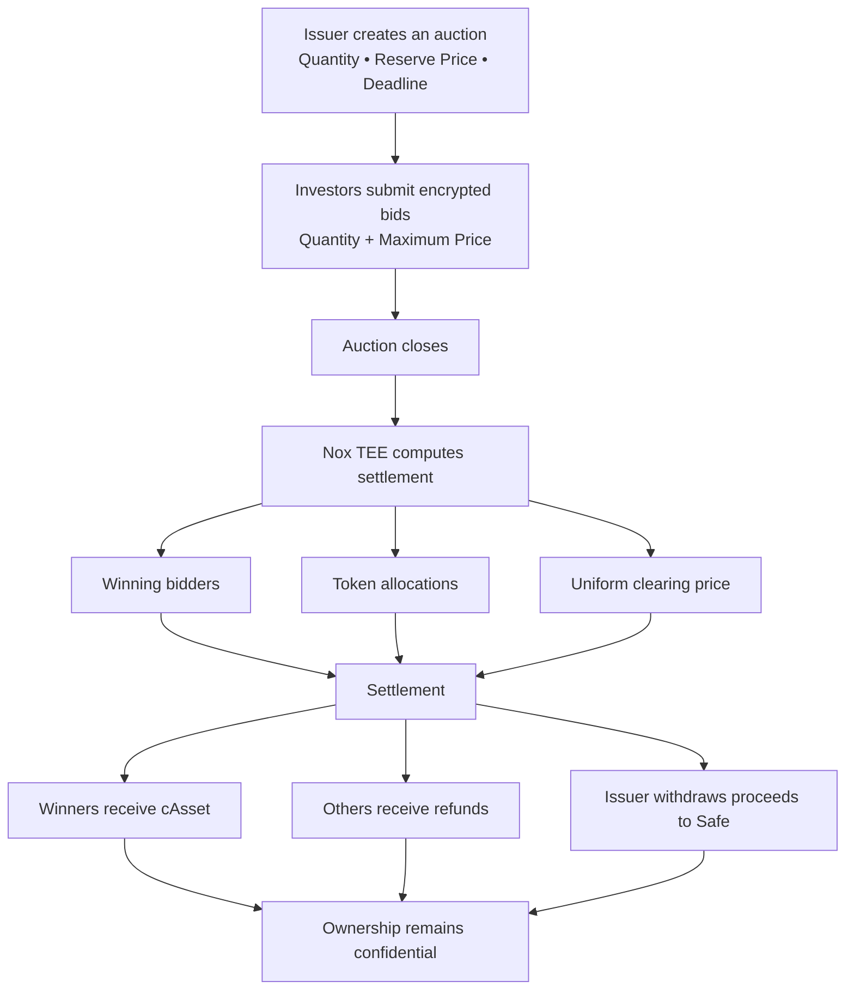

# Nirlipta

A confidential primary market platform for tokenized real-world assets, powered by Nox Protocol.

Nirlipta enables issuers to raise capital through sealed-bid auctions while keeping every investor's bid private. Instead of exposing prices and allocations on-chain, bids are encrypted on the client, processed inside a Trusted Execution Environment (TEE), and settled without revealing confidential information.

Unlike traditional on-chain auctions, confidentiality doesn't end when bidding closes. Ownership remains encrypted after settlement, while auditors can be granted selective access only when needed.

---

## Features

- 🔒 Confidential sealed-bid auctions
- ⚖️ Uniform clearing price settlement
- 🛡️ TEE-based bid computation with Nox Protocol
- 👤 Confidential token ownership after settlement
- ✅ Permissioned audit access without exposing the full ledger
- 💰 Safe treasury settlement for issuers

---

## How It Works


---

## Why Nirlipta?

Most on-chain auction systems focus on keeping bids private during the auction.

Nirlipta extends confidentiality beyond settlement.

- Bid prices stay encrypted throughout the auction.
- Allocations are computed inside a TEE.
- Token ownership remains confidential after settlement.
- Auditors receive access only when explicitly authorized by the issuer.

---

## Architecture

```text
AuctionFactory
        │
        ├──────────────► Auction
        │                  │
        │                  ├── Escrows cAsset
        │                  ├── Escrows cUSD deposits
        │                  ├── Computes settlement
        │                  └── Withdraws proceeds to Safe
        │
        ▼

cUSD / cAsset
(ERC-7984 Confidential Tokens)
```

### Smart Contracts

| Contract | Description |
|----------|-------------|
| `AuctionFactory.sol` | Deploys and tracks auction instances |
| `Auction.sol` | Handles bidding, settlement, claiming, and audit permissions |
| `CUSD.sol` | Confidential settlement token |
| `CAsset.sol` | Confidential asset token |
| `AuctionTypes.sol` | Shared structs and enums |

Nox infrastructure such as the Handle Gateway, KMS, Runner, and confidential execution environment is provided by the Nox Protocol.

---

## Deployed Contracts (Sepolia)

| Contract | Address |
|----------|----------|
| cUSD | `0x7309886ee42Aa29a796A479A01Eef07a61c8F6Fd` |
| cAsset | `0x43d81618774059F0172b7B32c972271a6440003D` |
| AuctionFactory | `0x39536Ea5789538D7F76999e8BDE5679526F815Df` |

---

## Quick Start

### Clone the repository

```bash
git clone https://github.com/RAKASAMUD/nirliptha.git
cd nirliptha/contracts
npm install
```

### Run tests

```bash
npx hardhat test
```

Docker is required because the Nox Hardhat plugin starts a local confidential computing environment automatically.

### Deploy to Sepolia

```bash
cp .env.example .env
```

Configure your environment variables, then deploy:

```bash
npx hardhat run scripts/deploy-tokens.ts --network sepolia

npx hardhat run scripts/deploy-factory.ts --network sepolia
```

---

## Auction Lifecycle

### 1. Create Auction

The issuer creates an auction, deposits the asset supply, and opens bidding.

### 2. Submit Bids

Investors choose a quantity and maximum price.

The bid is encrypted locally before being submitted to the blockchain.

### 3. Finalize

After the deadline, the issuer finalizes the auction.

Nox TEE computes:

- winning bidders
- allocations
- clearing price

without revealing individual bids.

### 4. Settlement

Winning investors receive cAsset.

Non-winning investors receive a refund.

The issuer withdraws settlement proceeds to a Safe treasury.

---

## Known Limitations

This project was built as a hackathon prototype.

Current limitations include:

- Wallet addresses remain pseudonymous rather than anonymous.
- `MAX_BIDS` is intentionally limited for the demo.
- cUSD is a demo confidential token and is not backed by real USDC.
- KYC and eligibility checks are not included.
- Secondary market trading is outside the current scope.

---

## Future Work

- Anonymous bidding through relayers
- KYC / ERC-3643 integration
- Secondary market support
- Multi-round auctions
- Pro-rata allocation
- Vesting support

---

## Tech Stack

- Solidity
- Hardhat 3
- Nox Protocol
- ERC-7984 Confidential Tokens
- Safe
- TypeScript

---

## License

MIT
